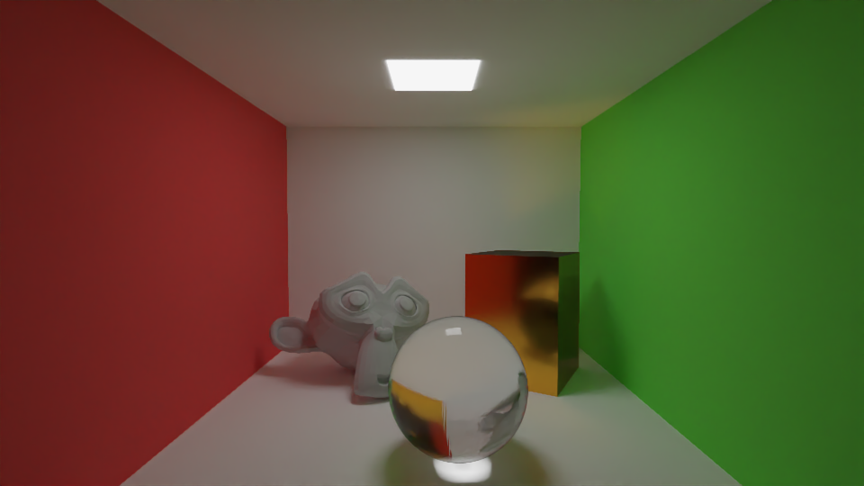
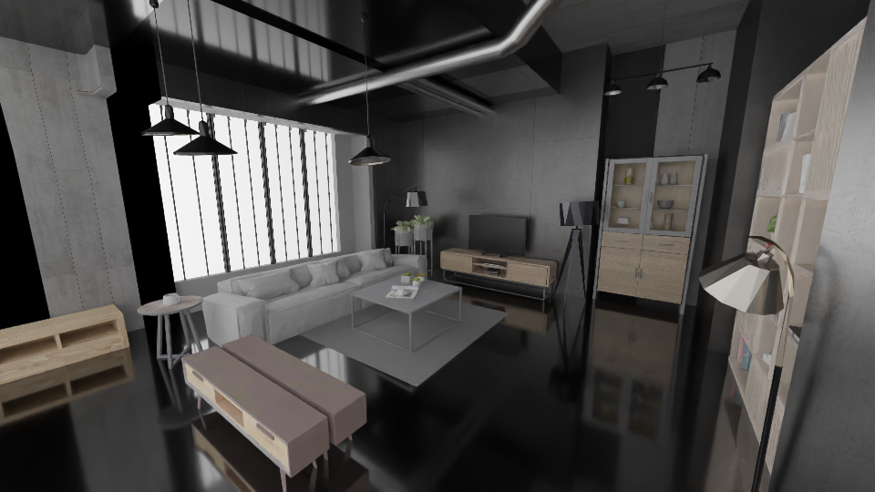

# Renderer

> Headless OpenGL compute shader physically based path tracer using EGL

---

## Demos

<table>
  <tr>
    <td></td>
    <td></td>
  </tr>
  <tr>
    <td></td>
    <td></td>
  </tr>
</table>

---

## Key features:
- **GLSL compute shaders for path tracing**
- **Physically based rendering**
- **EGL for headless rendering**
- **glTF 2.0 loading**
- **Open Image Denoiser**
- **Debug images output: raw, albedo, normals**
- **Logging system**
- **Unit tests with googleTest**
- **Docker ready**

---

## Build Options

### Build Modes

| Mode | CMake Flag | Output | Description |
|------|-----------|--------|-------------|
| **Core** | `-DBUILD_MODE=CORE` | `-` | Build only core rendering library for testing |
| **CLI** | `-DBUILD_MODE=CLI` | `renderer_cli` | Standalone CLI application |
| **Worker** | `-DBUILD_MODE=WORKER` | `renderer_worker` | Build renderer worker for web service |
| **Both** | `-DBUILD_MODE=BOTH` | `renderer_cli` + `renderer_worker` | Build both CLI and worker versions |

### Build Options

| Option | CMake Flag | Description |
|--------|-----------|-------------|
| **Tests** | `-DBUILD_TESTS=ON` | Build unit tests |

---

## 1. CLI version

### Build

#### Docker

```bash
docker build --file renderer/Dockerfile -t renderer --build-arg BUILD_MODE=CLI  .
```

#### CMake

```bash
cd renderer
mkdir build && cd build
cmake .. -DBUILD_MODE=CLI
cmake --build .
```

### Usage

#### Docker
```bash
docker run --rm renderer renderer_cli <width> <height> <samples> <input_scene> [OPTIONS]
```

#### CMake
```bash
./renderer_cli <width> <height> <samples> <input_scene> [OPTIONS]
```

###  Command line arguments

| Argument | Type | Description |
|----------|------|-------------|
| `width` | `int` | Output image width |
| `height` | `int` | Output image height |
| `samples` | `int` | Number of samples per pixel |
| `input_scene` | `string` | Path to .glb/.gltf scene file |

### Command line options

| Option | Type | Description |
|--------|------|-------------|
| `-h, --help` | `-` | Show help message |
| `-o, --output` | `string` | Output image path (default: output.png) |
| `-v, --verbose` | `-` | Enable detailed logging |
| `-d, --debug` | `-` | Save debug images (raw, albedo, normals) |
| `-p, --plane` | `float` | Add ground plane at scene center with specified size |
| `-c, --camera` | `vec3 vec3 float` | Set camera: `position lookAt fov` |
| `-B, --background` | `vec3` | Set background color (default: vec3(0,0,0)) |

---

## 2. Worker version

### Build

#### Docker
```bash
docker build --file renderer/Dockerfile -t renderer --build-arg BUILD_MODE=WORKER .
```

#### CMake
```bash
cd renderer
mkdir build && cd build
cmake .. -DBUILD_MODE=WORKER
cmake --build .
```
### Usage

#### Docker
```bash
docker run --rm renderer renderer_worker
```

#### CMake
```bash
cd renderer/build && ./renderer_worker
```

### Configuration

The worker can be configured using environment variables or a .env file in the priZm/renderer directory. 
> [!IMPORTANT]
Environment variables take precedence over values defined in the .env file and overwrite .env values.

| Variable |  Description | Required | Default |
|----------|--------------|----------|---------|
| `KAFKA_HOST` |	Kafka broker address | Yes | `-` |
| `KAFKA_GROUP_ID` |	Kafka consumer group ID |	Yes | `-` |
| `KAFKA_TOPIC_INPUT`	| Kafka topic to consume messages | Yes | `-` |
| `KAFKA_TOPIC_OUTPUT` | Kafka topic to produce messages |	Yes | `-` |
| `KAFKA_TOPIC_DLQ` | Kafka topic for dead letter queue |	Yes | `-` |
| `MAX_RETRIES` | Maximum retry attempts for failed messages |	No | `5` |
| `S3_HOST` |	S3 storage endpoint | Yes | `-` |
| `S3_ACCESS_KEY`	| S3 access key | Yes | `-` |
| `S3_SECRET_KEY`	| S3 secret key	| Yes | `-` |
| `S3_BUCKET_INPUT`	| S3 bucket name for input files | Yes | `-` |
| `S3_BUCKET_OUTPUT` | S3 bucket name for output files | Yes | `-` |
| `RENDERER_LOG_LEVEL`	| Log level (DEBUG, INFO, WARNING, ERROR)	|	No | `INFO` |
| `RENDERER_LOG_DEBUG`	| Enable debug logging (true/false)	| No | `true` |
| `RENDERER_PREVIEW` | Generate image in lower resolution and only 5 samples (true/false) | No | `false` |

### Preview

The worker can be configured to generate preview images. When preview mode is enabled, the renderer produces lower-quality outputs significantly faster, allowing you to verify scene composition and camera angles before committing to full-resolution renders.

<table>
  <tr>
    <th>Full Render (1920x1080, 1000 samples)</th>
    <th>Preview Mode (200x112, 5 samples)</th> 
  </tr>
  <tr>
    <td></td>
    <td></td>
  </tr>
</table>

---

## 3. Testing

#### Docker
```bash
docker build --file renderer/Dockerfile -t renderer --build-arg BUILD_MODE=CORE  --build-arg BUILD_TESTS=ON .
docker run --rm --entrypoint /bin/sh renderer -c "cd build/tests && ctest --output-on-failure"
```
### CMake
```bash
cd renderer
mkdir build && cd build
cmake .. -DBUILD_MODE=CORE
cmake --build .
./test
```
